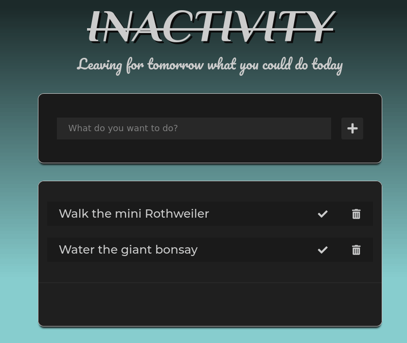

# Inactivity

## Table of Contents

- [Description](#description)
- [Organisation](#organisation)
- [Design](#design)
- [Live](#live)
- [Programming](#programming)
- [Credits](#credits)

## Description

This project is a classic TODO list, created for a WBS Coding School assignment.

## Organisation

- [Trello board](https://trello.com/b/uyk4uOu1/week-three-team-project)

## Design

- [Wireframe](https://memocan40.github.io/TodoList/design/wireframe.png)

## Live

For a live version of _TODO_, visit [GitHub Pages](https://memocan40.github.io/TodoList).

## Programming

This project has been developed using vanilla JS only.

### Architecture

The application has two classes:

**Task**

_Properties_

- \_id: Number
- \_description: String
- \_finished: Boolean

_Methods_

- constructor (description)
- get Id: Number
- set Id: Number
- get Description
- get Finished
- markAsDone ()
- undo ()

**Tasklist**

_Properties_

- \_tasks: Task array
- \_nextId: Number, default 0

_Methods_

- constructor ()
- get NextId: Number
- get Tasks: Array
- addTask (Task)
- deleteTask (id)

### Guidelines

- [CSS Rule order](https://9elements.com/css-rule-order)
- [Git set-up and workflow](./doc/git.md)
- Use [JS Doc](https://jsdoc.app/) to document JS

### Helpers

- [Prettier](https://prettier.io/): the file _.prettierrc.json_ in the root folder of the project makes sure everyone uses the same code formatter settings. You need to [install Prettier](https://prettier.io/docs/en/editors.html) for your code editor. Prettier can run 'on file save', so that you don't need to run it manually. Look for instructions on how to set it up in your code editor.

- [JSHint](https://jshint.com/): the file _.jshintrc_ in the root folder of the project makes sure we all validate our JS using the same settings. You need to [install JSHint](https://jshint.com/install/) for your code editor.

### Validators

These validators, even if not 100% up-to-date with the newest standards, still help in most cases:

- [HTML (W3C)](https://validator.w3.org)
- [CSS (W3C)](https://jigsaw.w3.org/css-validator)

## Credits

- Favicon by [flaticon.com](https://www.flaticon.com/free-icon/checklist-checked-box_46715)
